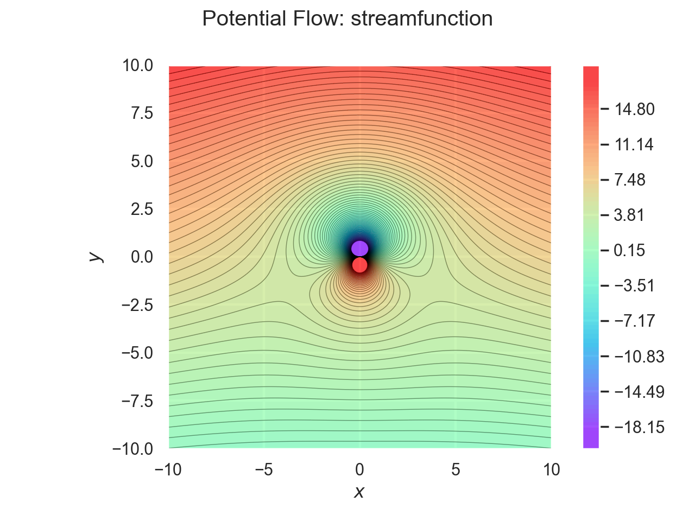
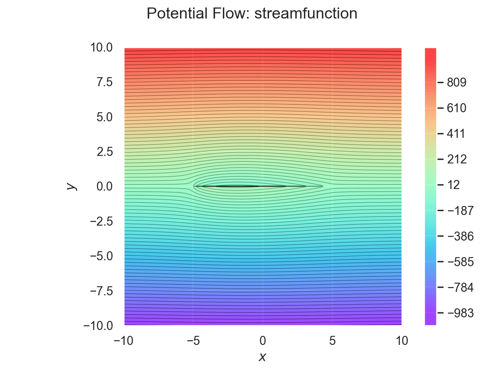
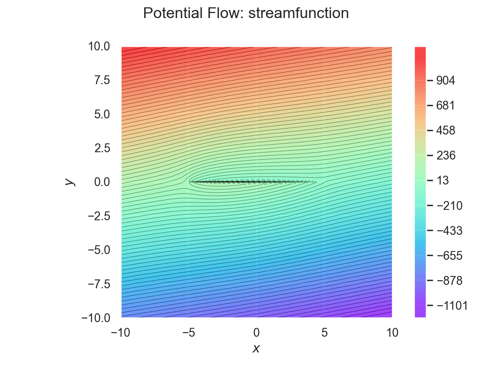

# PotentialFlowVisualizer (PFV)
**By Peter Sharpe**

*A fun, lightweight, tool to visualize potential flows quickly!*

## PFV Description
PotentialFlowVisualizer is a convenient Python library that can be used to quickly visualize various potential flow fields. If you're new to potential flows, I've written a short intro at the bottom of this document.

PFV syntax is explicitly designed to be concise and readable. Rendering of flow fields happens through Plot.ly's beautiful browser-based visualization tools. This library is designed to have minimal dependencies - it requires just NumPy and Plotly. 

## Examples

Here are a few examples to show you how you might use PFV to look at basic flowfields:

#### Freestream, Source, and Sink (Rankine Oval)
```python
from potentialflowvisualizer import *

field = Flowfield([
    Freestream(1, 0),
    Source(10, -3, 0),
    Source(-10, 3, 0),
])

field.draw("streamfunction")
```


#### Lifting Cylinder Flow
```python
from potentialflowvisualizer import *

field = Flowfield([
    Freestream(1, 0),
    Vortex(20, 0, 0),
    Doublet(-100, 0, 0, 0)
])

field.draw("streamfunction")
```


#### Nonlifting NACA0020
Here, we use some key results of slender body theory to model a thin streamlined body.
```python
from potentialflowvisualizer import *

# Body Geometry definition
x = np.linspace(-5, 5, 21)
c = np.max(x) - np.min(x)
x0 = np.min(x)
y = 0.2 * c * 10 * (
        + 0.2969 * ((x - x0) / c) ** 0.5
        - 0.1260 * ((x - x0) / c)
        - 0.3516 * ((x - x0) / c) ** 2
        + 0.2843 * ((x - x0) / c) ** 3
        - 0.1036 * ((x - x0) / c) ** 4
)
dy = np.diff(y)

# Freestream properties
V = 1

# Set up the flowfield
field = Flowfield([
    Freestream(V, 0)
])

field.objects.extend( # Add line sources to model the thickness
    [LineSource(V * dy[i], x[i], 0, x[i + 1], 0) for i in range(len(x) - 1)]
)
field.draw("streamfunction") # And visualize it
```



#### Nonlifting NACA0020 at an Angle
To first order, we can model the flow around a NACA0020 section at an angle by adding doublets. (Note that the lack of net vorticity means that this is a nonlifting flow.) As we can see, slender body theory starts to break down a bit in this case.
```python
from potentialflowvisualizer import *

# Body Geometry definition
x = np.linspace(-5, 5, 51)
c = np.max(x) - np.min(x)
x0 = np.min(x)
y = 0.2 * c * 10 * (
        + 0.2969 * ((x - x0) / c) ** 0.5
        - 0.1260 * ((x - x0) / c)
        - 0.3516 * ((x - x0) / c) ** 2
        + 0.2843 * ((x - x0) / c) ** 3
        - 0.1036 * ((x - x0) / c) ** 4
)
dy = np.diff(y)

# Freestream properties
V = 1
alpha = 10
alpha_rad = np.radians(alpha)

# Set up the flowfield
field = Flowfield([
    Freestream(V * np.cos(alpha_rad), V * np.sin(alpha_rad))
])

field.objects.extend( # Add line sources to model the thickness
    [LineSource(V * dy[i], x[i], 0, x[i + 1], 0) for i in range(len(x) - 1)]
)
field.objects.extend( # Add doublets to model crossflow
    [Doublet(2 * V * y[i] * alpha_rad, x[i], 0, np.radians(90)) for i in range(len(x))]
)

field.draw("streamfunction") # And visualize it
```


## Potential Flow: A 30-second Crash Course
Potential flow is a model of how fluids behave under certain mathematically-convenient assumptions. Potential flows can be described by a short, elegant equation:


Here,  is a scalar that represents the "velocity potential" at a given point - we use the word "potential", because it's sort of analogous to potential energy or a voltage potential. To find the velocity at a point, we look at the derivatives of the potential at that point:


There are a few "fundamental solutions" to this governing equation - a few of these are shown below. The governing equation is linear, so we can superimpose various fundamental solutions until we obtain a flowfield that describes some physically-relevant situation.

Because of this, potential flow is applicable to many common problems in aerodynamics and hydrodynamics. Furthermore, the ability to break complex flow fields into simple "fundamental solutions" allows engineers to gain an intuitive understanding of the physics at play - something that can be much more difficult with other, more complicated flow models.  

## License
MIT License

Copyright 2020 Peter Sharpe

Permission is hereby granted, free of charge, to any person obtaining a copy of this software and associated documentation files (the "Software"), to deal in the Software without restriction, including without limitation the rights to use, copy, modify, merge, publish, distribute, sublicense, and/or sell copies of the Software, and to permit persons to whom the Software is furnished to do so, subject to the following conditions:

The above copyright notice and this permission notice shall be included in all copies or substantial portions of the Software.

THE SOFTWARE IS PROVIDED "AS IS", WITHOUT WARRANTY OF ANY KIND, EXPRESS OR IMPLIED, INCLUDING BUT NOT LIMITED TO THE WARRANTIES OF MERCHANTABILITY, FITNESS FOR A PARTICULAR PURPOSE AND NONINFRINGEMENT. IN NO EVENT SHALL THE AUTHORS OR COPYRIGHT HOLDERS BE LIABLE FOR ANY CLAIM, DAMAGES OR OTHER LIABILITY, WHETHER IN AN ACTION OF CONTRACT, TORT OR OTHERWISE, ARISING FROM, OUT OF OR IN CONNECTION WITH THE SOFTWARE OR THE USE OR OTHER DEALINGS IN THE SOFTWARE.
